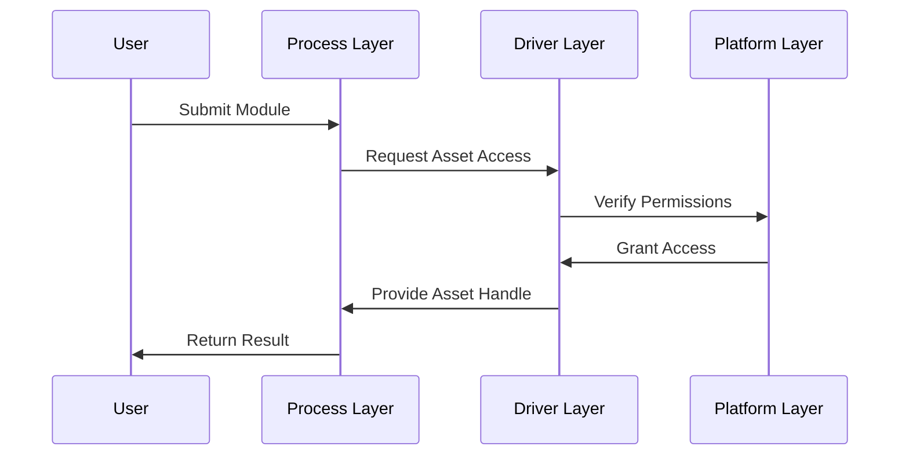
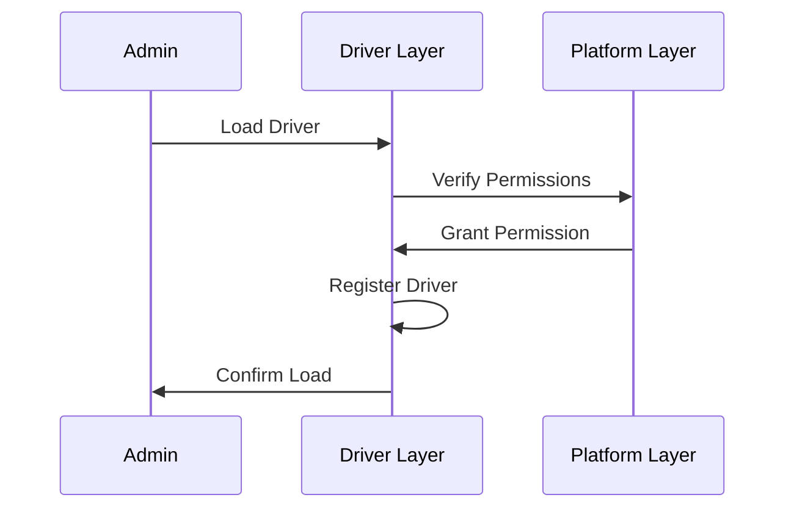

# UNITS Architecture

## Overview

UNITS is a modular and extensible runtime system for executing WebAssembly components with a focus on financial transactions and asset management. The system is designed with clear separation of concerns, modularity, and extensibility in mind.

## Core Features

- WebAssembly Component Model support
- Dynamic driver loading/unloading
- Pluggable storage backends
- Solana blockchain integration
- gRPC/gRPC-Web API interface
- Built-in health checks and metrics
- WASI support

## Three-Tier Architecture

The system follows a "burger architecture" with three distinct layers:

```
┌─────────────────────────┐
│     Process Layer       │ User workflows & WebAssembly modules
├─────────────────────────┤
│     Driver Layer        │ Asset abstraction & permissions
├─────────────────────────┤
│     Platform Layer      │ Low-level services & storage
└─────────────────────────┘
```

### Process Layer

The Process Layer is the topmost layer that interfaces directly with user workflows.

#### Key Components:
- WebAssembly module execution engine
- Virtual Asset Layer (VAL) interface
- Workflow lifecycle management
- Execution context handling

#### Responsibilities:
- Loading and executing user workflows
- Managing module lifecycle
- Providing VAL access to modules
- Handling execution permissions
- Resource management

### Driver Layer

The Driver Layer provides asset abstractions and manages permissions.

#### Key Components:
- Dynamic driver loader
- Permission manager
- Asset abstraction layer
- VAL implementation

#### Responsibilities:
- Loading/unloading drivers dynamically
- Managing driver versions
- Implementing asset abstractions
- Handling permissions
- Managing asset descriptors

### Platform Layer

The Platform Layer handles low-level system operations and integrations.

#### Key Components:
- Storage system
- Blockchain integrator
- Network handlers
- System services

#### Responsibilities:
- Managing storage backends
- Handling blockchain operations
- System-level permissions
- Service integration

## System Flow

1. **Module Execution Flow**


2. **Driver Loading Flow**


## Interface Definitions

### Process Layer Interface
```rust
// Main module interface
fn main(input: String) -> Result<String, UserError>;

// VAL interface for modules
fn intend(path: String) -> Result<String, DriverError>;
fn done(key: String) -> Result<(), DriverError>;
fn transfer(from: String, to: String, value: String) -> Result<(), DriverError>;
fn view(key: String) -> Result<String, DriverError>;
```

### Driver Layer Interface
```rust
// Driver implementation interface
fn intend(input: String) -> Result<String, DriverError>;
fn done(input: String) -> Result<(), DriverError>;
fn transfer(from: String, to: String, value: String) -> Result<(), DriverError>;
fn view(input: String) -> Result<String, DriverError>;
fn bind(input: String, existing: Option<String>) -> Result<String, DriverError>;
```

### Platform Layer Interface
```rust
// Storage interface
fn get(key: &str) -> Result<Option<String>, Error>;
fn set(key: &str, value: &str) -> Result<(), Error>;
fn delete(key: &str) -> Result<(), Error>;

// Blockchain interface
fn transfer_token(key: String, value: String) -> Result<TransferResponse>;
```

## Security Model

1. **Layered Security**
   - Each layer implements its own security checks
   - Permissions are verified at each boundary crossing
   - Resource limits are enforced at each level

2. **Asset Security**
   - Assets are accessed through descriptors
   - Descriptors are bound to specific drivers
   - Transfers require matching driver types

3. **System Security**
   - Driver loading requires admin privileges
   - Module execution is sandboxed
   - Resources are strictly controlled

## Extension Points

The system provides several extension points for customization:

1. **Driver Extensions**
   - New asset type support
   - Custom permission models
   - Specialized protocols

2. **Platform Extensions**
   - Additional storage backends
   - New blockchain integrations
   - Custom service integrations

3. **Process Extensions**
   - Custom workflow types
   - Specialized execution modes
   - Resource management policies
